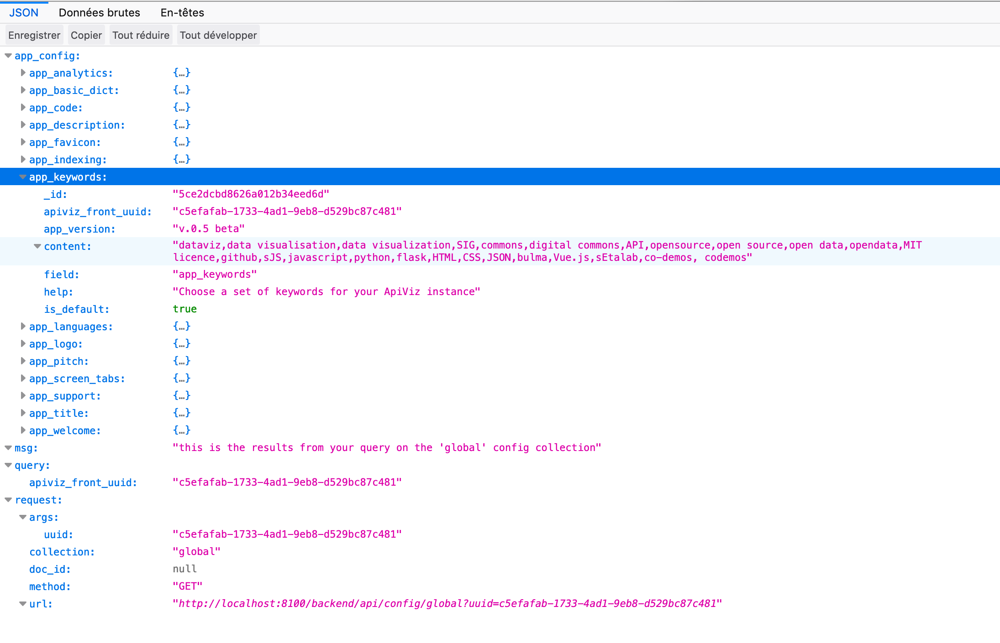

<h2 align=center>
	 
  BACKEND
</h2>

-------
## PRESENTATION

Visualize data coming from an API in a CMS-like app. 
If your data is stored somewhere and accessible via an API, ApiViz can transform it into a full website to show it at its best. 

ApiViz includes "out-the-box" a back-office to fully configure an original datavisualisation website : 
  - **navbar** : define the logo, links, and menus in your apiviz instance's navabr. 
  - **styles** : define the CSS styles for your apiviz instance.
  - **routes** : define the pages and routes of your apiviz instance, either statics contents or data views.
  - **data endpoints** : define the data endpoints feeding your apiviz instance and the fields you want to display.
  - **global** : define some metadata for your apiviz instance.
  - **footer** : define the links present in the apiviz instance's footer.

--------

## DOCUMENTATION

Check our brand new [documentation website](https://co-demos.github.io/apiviz-backend/) here : 

https://co-demos.github.io/apiviz-backend/

--------

#### warning : 

**apiviz-backend** is the backend of the **APIVIZ-FRONTEND** application, it provides the API for serving its configuration to any **[apiviz-frontend](https://github.com/co-demos/apiviz-frontend)** instance.

--------

## THE APIVIZ ECOSYSTEM

ApiViz is designed to **agnosticaly display data** and provide an engine to deploy a **datavisualisation website** without (too much) pain, not regarding to the service(s) serving and storing the data. 

Nevertheless to do so an instance of ApiViz must be connected to several external services : one for authentication, one for serving the data, one for storing the static contents (html pages, images...).

The goal of ApiViz is to **work with any external service** fulfilling those roles, but we developed an **eco-system of open source applications** allowing a complete and free way to deploy such a datavisualisation service. 

 

| logo | 
the open source eco-system ( aka TADATA! )
 |
|    :----:   |          :--- |
|  | **[Apiviz](https://github.com/co-demos/ApiViz)** as the high-level app for visualisation, a sort of open source CMS for data-visualisation ;   |
|  | **[Solidata](https://github.com/entrepreneur-interet-general/solidata_frontend)** to "API-fy" your data and manage open data projects ; |
|  | **[TokTok](https://github.com/co-demos/toktok)** for a dedicated authentication service to manage users, JWT, and roles.  |
|  | **[OpenScraper](https://github.com/entrepreneur-interet-general/OpenScraper)** is a generic web scraper serving the results of the scraping via its API  |

In the following illustration you can have a general idea of how those several services could work altogether. Check the [`/documentation/configurations`](./documentation/configurations) folder to have a broader look to [other configurations](./documentation/configurations/APIVIZ_CONFIGURATIONS-export.pdf).

<h2 align=center>
	
</h2>

You can also check those several projects and repository to find some layout for your specific new datavisualisation website : 
- Sonum repo ;
- CIS repo ;
- ... and more to come... 

**Note** : all the schemas were realized with [VUE - Visual Understanding Environment](https://vue.tufts.edu/index.cfm), an open source mind mapping tool. The source file for the schemas is [here](./documentation/configurations/APIVIZ_CONFIGURATIONS.vue)

-------

## SCREENSHOTS (development)

------------

#### API RESPONSE (Sonum client configuration, 'global' collection)
serves your **[apiviz-backend](https://github.com/co-demos/apiviz-frontend)** configuration 
<h2 align=center>
	
</h2>

